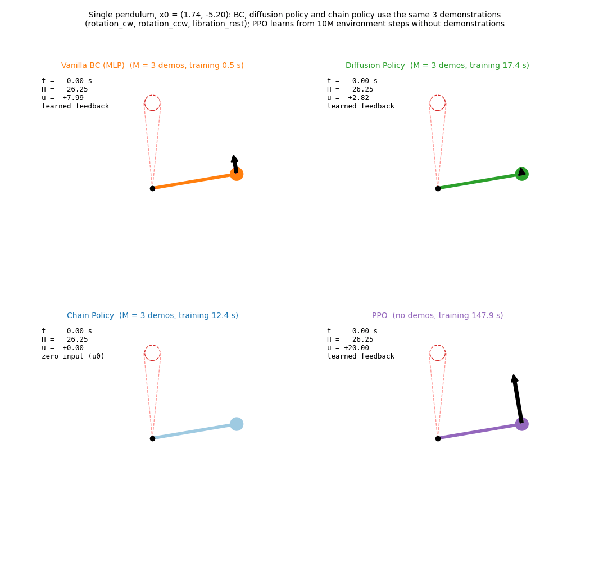
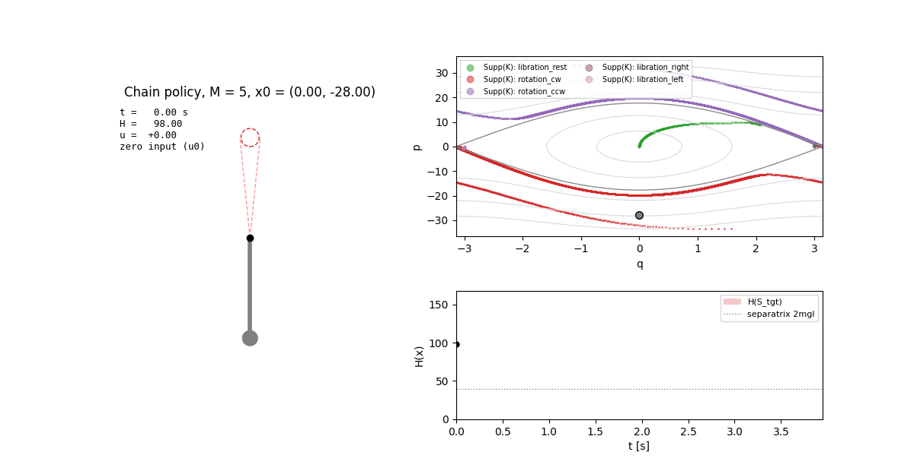
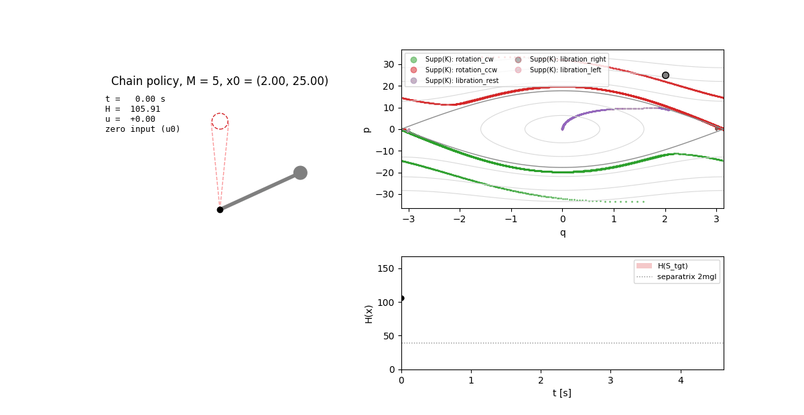
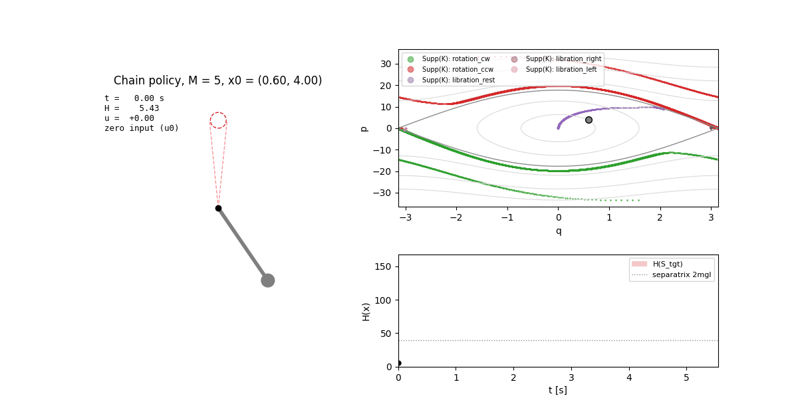
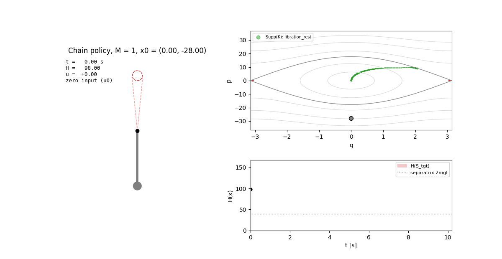
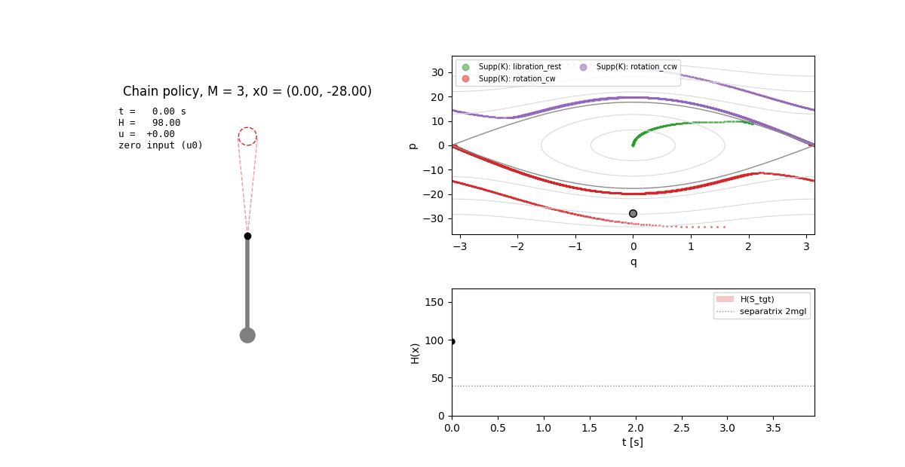
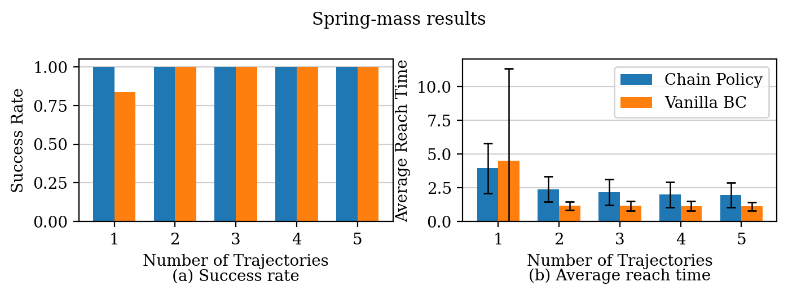
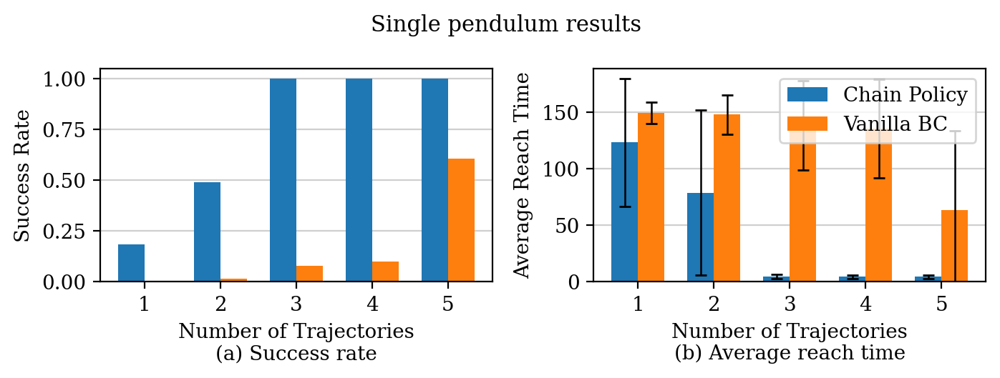
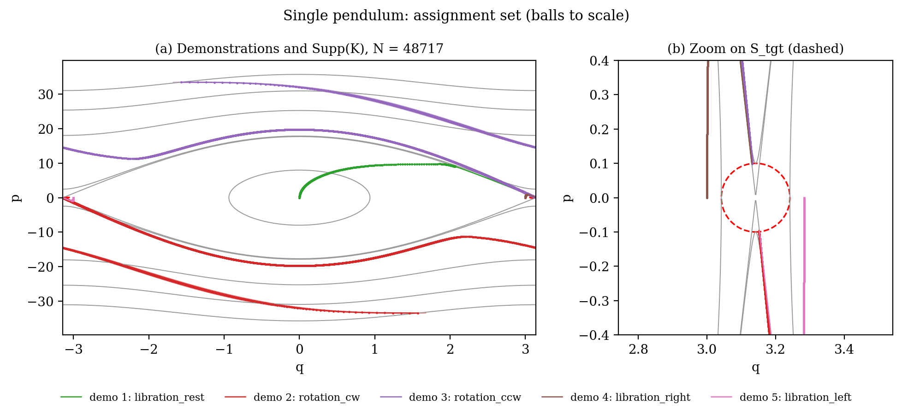

# Symplectic Inductive Bias for Data-Driven Target Reachability in Hamiltonian Systems

<div align="center">

[[Arxiv]](https://arxiv.org/abs/2604.17213)

[](https://www.python.org/)
[](https://www.do-mpc.com/)
[](https://pytorch.org/)

**Same 3 expert demonstrations: chain policy (left) vs vanilla behavior cloning (middle)**



</div>

Implementation of **nonparametric chain policies** for target reachability in Hamiltonian systems, from
[*Symplectic Inductive Bias for Data-Driven Target Reachability in Hamiltonian Systems*](https://arxiv.org/abs/2604.17213)
(Zhuo Ouyang, Jixian Liu, Enrique Mallada).  From just 3 expert trajectories the chain policy
steers a pendulum to the upright position from **every** test state, while behavior cloning trained on
the same 3 trajectories succeeds from 8% of them.


## Why chain policies?

Data-driven control of nonlinear systems usually relies on smoothness alone, and covering the state
space then needs data that grows **exponentially with the dimension**.  Physical systems carry a much
stronger inductive bias: a lossless Hamiltonian system conserves energy, and its zero-input flow keeps
**returning** to every region of an energy layer.

The chain policy exploits both facts:

1. **Certified snippets.**  Cut the expert trajectories into short open-loop control snippets.  Each one
   comes with a ball of initial states (Algorithm 1) from which it provably moves the energy toward the
   target band.
2. **Recurrence does the rest.**  Outside the balls the input is simply zero.  The energy is then
   conserved, and the Hamiltonian flow carries the state back into some ball, where the next snippet
   takes over.

The demonstrations therefore only need to cover **energy levels and ergodic components**, not the whole
state space.  The pendulum has three ergodic components (libration, clockwise rotation and
counter-clockwise rotation), and a single policy built from 5 demonstrations handles all of them.
Rod colour = demonstration whose snippet is running, grey = zero input.

Clockwise rotation  |  Counter-clockwise rotation  |  Libration
:-------------------------:|:-------------------------:|:-------------------------:
 |  | 

### Coverage of ergodic components is what matters

Take the same rotating initial state.  With only the libration demonstration (M = 1) the state never
meets the support of the policy: energy is conserved and it rotates forever.  Once a rotation
demonstration is added (M = 3), the zero-input flow brings it into a certified ball within one
revolution, and it reaches the target in 3.9 s.

M = 1 (libration demo only)  |  M = 3 (+ rotation demos)
:-------------------------:|:-------------------------:
 | 

### Results

500 initial states drawn uniformly from {H ≤ H̄}.  The policies use the first M demonstrations.  BC
results are averaged over 5 training seeds, and a failed run counts as the full horizon.

Spring-mass (horizon 20 s) | Single pendulum (horizon 150 s)
:-------------------------:|:-------------------------:
 | 

* **Spring-mass:** the chain policy reaches the target from every state for every M, and its reach
  time drops from 3.9 s to 2.0 s.
* **Pendulum:** chain policy success is 0.18 / 0.49 / 1.0 / 1.0 / 1.0 for M = 1..5, and it reaches
  100% as soon as all three ergodic components are demonstrated (M = 3).  BC stays at
  0.004 / 0.014 / 0.08 / 0.10 / 0.61.
* Theorem 2's certificate (local energy decrease) is checked on every K_M: 0 violations.  The full
  report is in [`outputs/summary.md`](outputs/summary.md).

Assignment set of the pendulum: the expert trajectories and the certified balls, which are drawn to
scale and are tiny.




## Installation

```shell
python -m venv .venv && source .venv/bin/activate
pip install -r requirements.txt
```


## Run

Reproduce the experiments of the paper (Section IV).  One command runs NMPC experts → Algorithm 1 →
chain policy and BC for M = 1..5 → figures:

```shell
python -m symplectic_ncp.experiments.run --systems spring_mass single_pendulum --out outputs
# ~1.5 min (spring-mass) + ~14 min (pendulum); add --quick for a 50-state smoke run
```

This writes, for each system, `outputs/<system>/{demonstrations,assignments,rollouts}.npz` and
`results.json`.  It also writes the figures in `outputs/figures/` and the table in `outputs/summary.md`.

Other entry points:

```shell
# expert demonstrations only (NMPC with CasADi + do-mpc)
python -m symplectic_ncp.experts.generate --systems spring_mass single_pendulum --out outputs

# figures from saved results
python -m symplectic_ncp.experiments.plotting --out outputs

# sensitivity of BC to the training choices the paper leaves open (batch size, sampling, seeds)
python -m symplectic_ncp.experiments.bc_sensitivity --out outputs

# tests
python -m pytest tests -q
```


## Visualization

```shell
# chain policy vs BC trained on the same 3 demonstrations  ->  outputs/comparison.gif
python -m symplectic_ncp.experiments.compare_animation --out outputs

# pendulum under the chain policy, one GIF per ergodic component  ->  outputs/figures/
python -m symplectic_ncp.experiments.animate --out outputs
# any initial state / number of demonstrations
python -m symplectic_ncp.experiments.animate --out outputs --x0 0.0 -28.0 --num-demos 1
```


## Code structure

```text
symplectic_ncp/
├─ config.py                  # all experiment parameters
├─ systems/                   # x' = J ∇H(x) + G u: spring-mass, single pendulum (Def. 1)
├─ target.py                  # S_tgt, energy band, energy distance ΔH (Def. 8)
├─ experts/                   # NMPC expert, demonstration generation
├─ chain/
│  ├─ assignment_set.py       # assignment set K = {(x_i, r_i, u_i)} (Defs. 5–6)
│  ├─ construction.py         # Algorithm 1: certified radii, snippets, Lipschitz constants
│  ├─ policy.py               # chain policy π_K (Def. 7)
│  └─ theory.py               # checks of Theorem 2, Lemma 1, Theorems 3–4
├─ simulation/                # event-driven closed loop (Remark 2), continuous-time ball entry
├─ baselines/                 # vanilla BC: MLP (24, 24, 16), Adam, lr 1.2e-3, wd 5e-4, 40 epochs
├─ evaluation/                # uniform test states on {H ≤ H̄}
└─ experiments/               # pipeline, CLI, plots, animations, BC sensitivity
tests/                        # 92 tests: math, Algorithm 1 invariants, simulator vs brute force, pipeline
```


## Notes

* **Continuous time, as in the paper.**  Algorithm 1 places the next anchor exactly where the
  demonstration leaves the current ball, so consecutive balls touch and the covered energies have no
  gaps.  The simulator likewise detects the exact instant at which the zero-input flow enters a ball.
  The certified radii are tiny (down to ~1e-8 on the pendulum), so checking only at sample times
  would miss almost every entry.
* **Global constants.**  L_H and L of Assumptions 1–2 are computed on an energy sublevel set that
  contains the test states, the demonstrations and every certified ball.  No radius floors or entry
  thresholds are used.
* **Experts.**  NMPC with |u| ≤ 20.  For the pendulum, one demonstration per ergodic component;
  libration demonstrations are kept below the separatrix.
* **Pendulum, M = 1–2.**  A snippet only guarantees that the distance to the target *energy band*
  shrinks, so it can push a libration state just over the separatrix into a rotation that is not yet
  covered.  The Theorem 2 report flags this as a coverage gap; it disappears at M = 3.
* **BC is sensitive to unstated training choices.**  With a smaller batch, BC also reaches 1.0 at
  M = 4–5 on the pendulum.  With M ≤ 3 it stays far below the chain policy in every setting
  ([`bc_sensitivity.json`](outputs/single_pendulum/bc_sensitivity.json)).


## Citation

```bibtex
@article{ouyang2026symplectic,
  title   = {Symplectic Inductive Bias for Data-Driven Target Reachability in Hamiltonian Systems},
  author  = {Ouyang, Zhuo and Liu, Jixian and Mallada, Enrique},
  journal = {arXiv preprint arXiv:2604.17213},
  year    = {2026}
}
```
