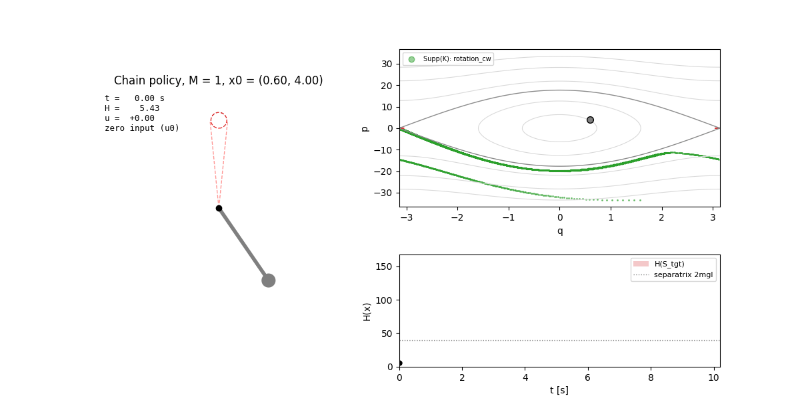
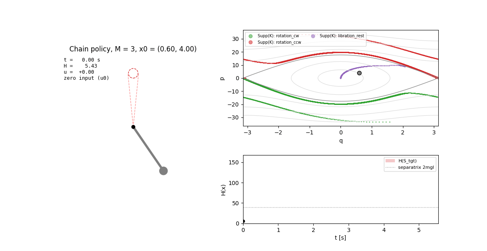
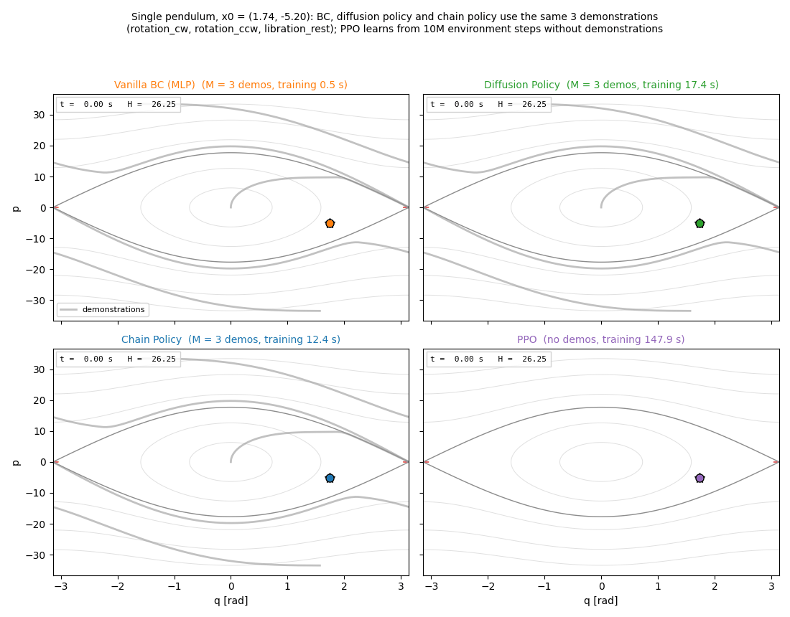
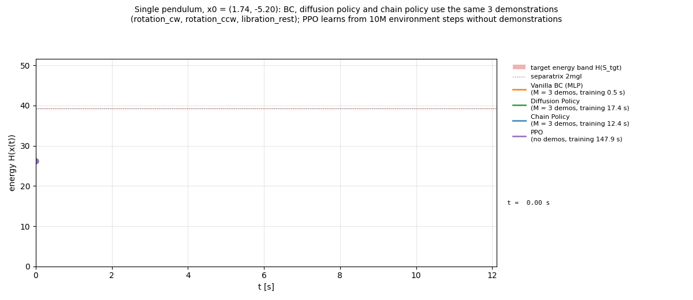
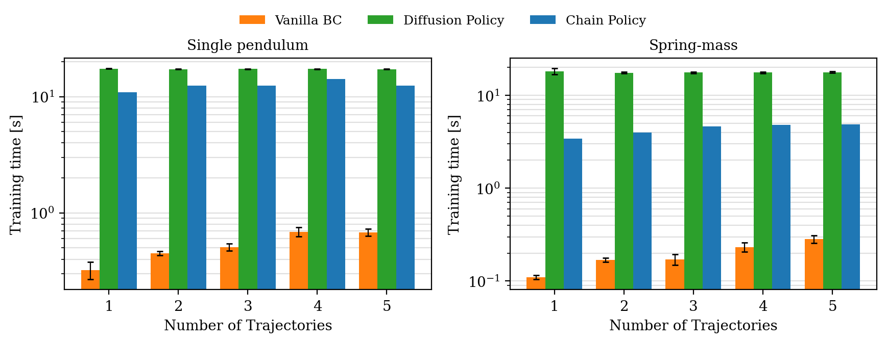

# Symplectic Inductive Bias for Data-Driven Target Reachability in Hamiltonian Systems

<div align="center">

[[Arxiv]](https://arxiv.org/abs/2604.17213)

[](https://www.python.org/)
[](https://www.do-mpc.com/)
[](https://pytorch.org/)

**Vanilla BC · Diffusion Policy · Chain Policy (same 3 demonstrations) · PPO (no demonstrations, 10M steps)**


</div>

Implementation of **nonparametric chain policies** for target reachability in Hamiltonian systems, from
[*Symplectic Inductive Bias for Data-Driven Target Reachability in Hamiltonian Systems*](https://arxiv.org/abs/2604.17213)
(Zhuo Ouyang, Jixian Liu, Enrique Mallada).  From just 3 expert trajectories (11 s of data) the chain
policy steers a pendulum upright from **every** test state after **12 s of training on a CPU**.  The
alternatives are slower to train or less reliable:

* A diffusion policy needs a GPU and more training time on the same data.
* PPO needs 10 million environment steps and 2.5 minutes of GPU training.
* Behavior cloning on the same data succeeds from only 24% of the test states.


## Why chain policies?

Data-driven control of nonlinear systems usually relies on smoothness alone, and covering the state
space then needs data that grows **exponentially with the dimension**.  Physical systems carry a much
stronger inductive bias: a lossless Hamiltonian system conserves energy, and its zero-input flow keeps
**returning** to every region of an energy layer.

The chain policy exploits both facts:

1. **Certified snippets.**  Cut the expert trajectories into short open-loop control snippets.  Each one
   comes with a ball of initial states (Algorithm 1) from which it provably moves the energy toward the
   target band.
2. **Recurrence does the rest.**  Outside the balls the input is simply zero.  The energy is then
   conserved, and the Hamiltonian flow carries the state back into some ball, where the next snippet
   takes over.

The demonstrations therefore only need to cover **energy levels and ergodic components**, not the whole
state space.  The pendulum has three ergodic components (clockwise rotation, counter-clockwise
rotation and libration), and a single policy built from 5 demonstrations handles all of them.
Rod colour = demonstration whose snippet is running, grey = zero input.

Clockwise rotation  |  Counter-clockwise rotation  |  Libration
:-------------------------:|:-------------------------:|:-------------------------:
 |  | 

### Coverage of ergodic components is what matters

The pendulum demonstrations are ordered by component: clockwise rotation, counter-clockwise rotation,
then libration.  Take a swinging (libration) initial state:

* **M = 1:** only the clockwise demonstration is available.  The state never meets the support of
  the policy; energy is conserved and it swings forever.
* **M = 3:** the libration demonstration has been added.  The zero-input flow carries the state into
  a certified ball and it reaches the target in 5.4 s.

Every added component adds about a third of the test states: chain-policy success is 0.31 → 0.65 → 1.0.

M = 1 (rotation demo only)  |  M = 3 (+ libration demo)
:-------------------------:|:-------------------------:
 | 


## One initial state, four methods

The same run as the GIF at the top: a swinging pendulum, with BC, the diffusion policy and the chain
policy trained on the same 3 demonstrations, and PPO.

* **Phase portrait.**  Grey curves are the demonstrations; red discs are the target.  The chain
  policy waits on its energy layer (zero input) until the flow meets a demonstration.  It then rides
  a certified snippet up to the separatrix.
* **Energy.**  The chain policy's energy is flat while it waits, then jumps into the target band in
  one step.  BC keeps oscillating around the separatrix and never settles.






## Results

The test set is 500 initial states drawn uniformly from {H ≤ H̄}.  The policies use the first M
demonstrations.  The learned methods are averaged over their seeds (BC: 5, diffusion policy: 3).  A
failed run counts as the full horizon.

Spring-mass (horizon 20 s) | Single pendulum (horizon 150 s)
:-------------------------:|:-------------------------:
 | 

| Pendulum success | M = 1 | M = 2 | M = 3 | M = 4 | M = 5 |
|---|---|---|---|---|---|
| Vanilla BC | 0.02 | 0.02 | 0.24 | 0.30 | 0.73 |
| Diffusion policy | 0.01 | 0.01 | 0.98 | 1.00 | 1.00 |
| **Chain policy** | **0.31** | **0.65** | **1.00** | **1.00** | **1.00** |

* **Spring-mass:** the chain policy reaches the target from every state for every M.  The diffusion
  policy and BC reach 100% from M = 2 on.
* **Pendulum:** the chain policy gains one ergodic component per demonstration.  BC and the diffusion
  policy stay near 0 until the demonstrations cover enough of the state space (M = 3).  Away from the
  data they act on extrapolated inputs instead of waiting on an energy layer.  With the two rotation
  demonstrations, failed diffusion-policy runs settle into a low swing (median final energy H ≈ 21),
  far below the target energy 2mgℓ ≈ 39.
* With enough demonstrations (M ≥ 3), the diffusion policy matches the chain policy's success and
  reaches the target about as fast.  The difference is its training cost (below).
* Theorem 2's certificate (local energy decrease) is checked on every K_M: 0 violations.  The full
  table, including the Theorem 2 coverage diagnostics, is in [`outputs/summary.md`](outputs/summary.md).


## Training time

Wall-clock time of each method's training call on one machine (16-thread CPU, RTX 4070 Laptop GPU).
Mean ± std over seeds, in seconds.  Demonstration generation is shared by the imitation methods and
excluded.  For the chain policy, "training" is Lipschitz constants + Algorithm 1 on the first M
demonstrations; it is deterministic and runs on the CPU, one process per demonstration.  Raw data:
[`outputs/training_time.csv`](outputs/training_time.csv).



**Single pendulum**

| Method | device | M=1 | M=2 | M=3 | M=4 | M=5 |
|---|---|---|---|---|---|---|
| Vanilla BC | CPU | 0.32 ± 0.05 | 0.45 ± 0.02 | 0.51 ± 0.04 | 0.69 ± 0.06 | 0.68 ± 0.05 |
| Diffusion policy | GPU | 17.4 ± 0.1 | 17.2 ± 0.1 | 17.3 ± 0.1 | 17.3 ± 0.0 | 17.2 ± 0.0 |
| **Chain policy** | CPU | **10.9** | **12.5** | **12.4** | **14.1** | **12.4** |

**Spring-mass**

| Method | device | M=1 | M=2 | M=3 | M=4 | M=5 |
|---|---|---|---|---|---|---|
| Vanilla BC | CPU | 0.11 ± 0.01 | 0.17 ± 0.01 | 0.17 ± 0.02 | 0.23 ± 0.03 | 0.28 ± 0.03 |
| Diffusion policy | GPU | 18.2 ± 1.3 | 17.5 ± 0.3 | 17.7 ± 0.3 | 17.6 ± 0.4 | 17.7 ± 0.3 |
| **Chain policy** | CPU | **3.4** | **4.0** | **4.6** | **4.8** | **4.9** |

**PPO** (`symplectic_ncp/baselines/ppo.py`) learns from interaction instead of demonstrations, so it
has a single training cost per system:

| System | data | device | training time [s] |
|---|---|---|---|
| Single pendulum | 10M environment steps (≈ 56 h simulated) | GPU | 147 ± 4 |
| Spring-mass | 1M environment steps (≈ 5.6 h simulated) | CPU | 87 ± 2 |

* **Network:** separate tanh MLPs (64, 64) for the actor and the critic, with a Gaussian policy with
  state-independent std.
* **Optimiser:** Adam, lr 3e-4; GAE λ = 0.95, clip 0.2, 10 epochs per update; observation and return
  normalisation.
* **Environment:** resets uniform on {H ≤ H̄}; a success bonus for entering S_tgt.  On the pendulum:
  potential-based distance + energy shaping, 1024 parallel environments.  On the spring-mass:
  distance cost, 64 environments.
* **Result:** after training, PPO reaches the target from all 500 test states on both systems
  (3 seeds).

The chain policy trains faster than the diffusion policy and PPO, without a GPU, and comes with a
certificate.  Vanilla BC is faster still, but on the pendulum it is not reliable even with 5
demonstrations.

<details>
<summary>Diffusion-policy and BC architectures (the diffusion policy is our choice; the paper specifies BC)</summary>

* **Diffusion policy** (`symplectic_ncp/baselines/diffusion_policy.py`), following Chi et al. 2023:
  * conditional DDPM over action chunks, predicting 16 steps and executing 8 (0.32 s / 0.16 s);
  * noise-prediction network: residual MLP (width 256, 3 FiLM blocks) conditioned on the state
    (angles as sin/cos) and a sinusoidal step embedding;
  * 100 training noise levels, cosine schedule; 10-step deterministic DDIM at run time;
  * AdamW, lr 1e-3, 20k iterations, batch 256, EMA weights;
  * CUDA-graph training and sampling.
* **Vanilla BC** (paper): MLP (24, 24, 16), Adam, lr 1.2e-3, weight decay 5e-4, 40 epochs, batch 64.

</details>


## Installation

```shell
python -m venv .venv && source .venv/bin/activate
pip install -r requirements.txt
```


## Run

Reproduce the experiments of the paper (Section IV) and the ablations in one command.  It runs NMPC
experts → Algorithm 1 → chain policy, BC and diffusion policy for M = 1..5, and PPO → figures:

```shell
python -m symplectic_ncp.experiments.run --systems spring_mass single_pendulum --out outputs
# ~15 min (spring-mass) + ~30 min (pendulum) with a GPU
# --methods chain bc      paper methods only (~1.5 + ~14 min);   --quick   50-state smoke run
```

This writes the following:
* for each system, `outputs/<system>/`: `demonstrations.npz`, `assignments_M<M>.npz`, `results.json`,
  `rollouts.npz`, `training_time.csv` and `models/` (diffusion-policy and PPO weights);
* `outputs/figures/` and the summary tables in `outputs/summary.md`;
* `outputs/training_time.csv`, combined over both systems.

Other entry points:

```shell
# expert demonstrations only (NMPC with CasADi + do-mpc)
python -m symplectic_ncp.experts.generate --systems spring_mass single_pendulum --out outputs

# figures and tables from saved results
python -m symplectic_ncp.experiments.plotting --out outputs

# sensitivity of BC to the training choices the paper leaves open (batch size, sampling, seeds)
python -m symplectic_ncp.experiments.bc_sensitivity --out outputs

# tests
python -m pytest tests -q
```


## Visualization

```shell
# the four methods from one initial state (imitation methods: M = 3)
#   -> outputs/comparison.gif, outputs/comparison_phase_orbit.gif, outputs/energy_flow.gif
python -m symplectic_ncp.experiments.compare_animation --out outputs

# pendulum under the chain policy, one GIF per ergodic component  ->  outputs/figures/
python -m symplectic_ncp.experiments.animate --out outputs
# any initial state / number of demonstrations
python -m symplectic_ncp.experiments.animate --out outputs --x0 0.6 4.0 --num-demos 1
```


## Code structure

```text
symplectic_ncp/
├─ config.py                  # all experiment parameters
├─ systems/                   # x' = J ∇H(x) + G u: spring-mass, single pendulum (Def. 1)
├─ target.py                  # S_tgt, energy band, energy distance ΔH (Def. 8)
├─ experts/                   # NMPC expert, demonstration generation
├─ chain/
│  ├─ assignment_set.py       # assignment set K = {(x_i, r_i, u_i)} (Defs. 5–6)
│  ├─ construction.py         # Algorithm 1: certified radii, snippets, Lipschitz constants
│  ├─ policy.py               # chain policy π_K (Def. 7)
│  └─ theory.py               # checks of Theorem 2, Lemma 1, Theorems 3–4
├─ simulation/                # event-driven closed loop (Remark 2), continuous-time ball entry,
│                             # feedback / action-chunk policies
├─ baselines/
│  ├─ behavior_cloning.py     # vanilla BC (paper)
│  ├─ diffusion_policy.py     # ablation: diffusion policy
│  └─ ppo.py                  # ablation: PPO
├─ evaluation/                # uniform test states on {H ≤ H̄}
└─ experiments/               # pipeline, CLI, plots, animations, BC sensitivity
tests/                        # 119 tests: math, Algorithm 1 invariants, simulator vs brute force, baselines, pipeline
```


## Notes

* **Continuous time, as in the paper.**  Algorithm 1 places the next anchor exactly where the
  demonstration leaves the current ball, so consecutive balls touch and the covered energies have no
  gaps.  The simulator likewise detects the exact instant at which the zero-input flow enters a ball.
  The certified radii are tiny (down to ~1e-8 on the pendulum), so checking only at sample times
  would miss almost every entry.
* **Global constants.**  L_H and L of Assumptions 1–2 are computed on an energy sublevel set that
  contains the test states, the demonstrations and every certified ball.  No radius floors or entry
  thresholds are used.
* **Experts.**  NMPC with |u| ≤ 20.  For the pendulum there is one demonstration per ergodic
  component; libration demonstrations are kept below the separatrix.
* **BC is sensitive to unstated training choices** (batch size, sampling of the training pairs):
  see [`outputs/single_pendulum/bc_sensitivity.json`](outputs/single_pendulum/bc_sensitivity.json).
  That pendulum study used the earlier demonstration order (libration first).
* **Diffusion policy at M ≤ 2.**  Standard remedies did not help, and none of them used extra expert
  data.  We tried observation-noise augmentation (σ = 0.1, 0.3) and six chunk, noise and network
  variants, under both demonstration orders (rotation first or libration first); M = 1, 2 stayed at
  0.4–1.8%.  The step at M = 3 is a coverage threshold of the learned policy, not a tuning artefact.


## Citation

```bibtex
@article{ouyang2026symplectic,
  title   = {Symplectic Inductive Bias for Data-Driven Target Reachability in Hamiltonian Systems},
  author  = {Ouyang, Zhuo and Liu, Jixian and Mallada, Enrique},
  journal = {arXiv preprint arXiv:2604.17213},
  year    = {2026}
}
```
